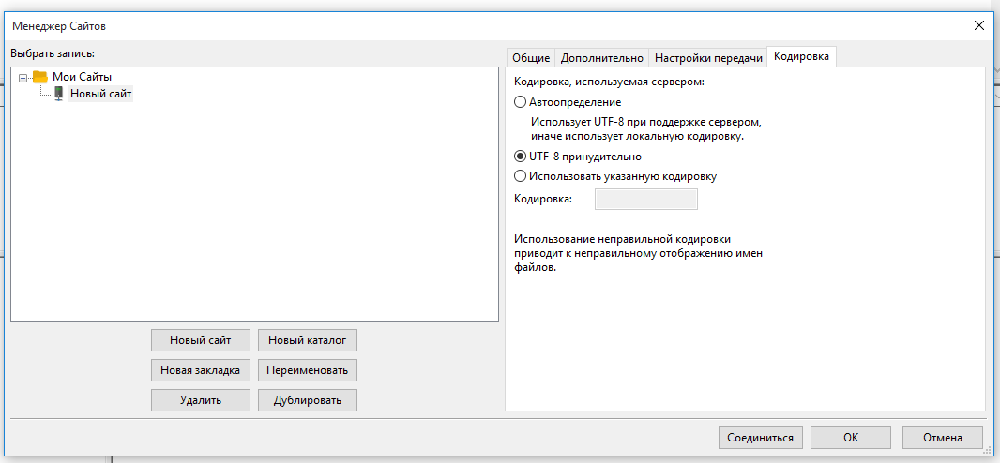
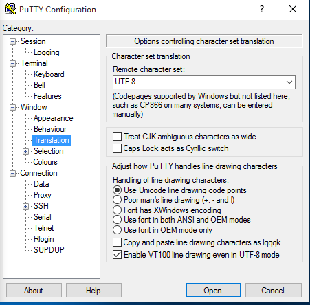

=====
pyRMA
=====
**pyRMA** - Система контроля удаленного доступа к серверному и сетевому
оборудованию по протоколам SSH и TELNET.

Установка
=========
Требования
----------
* **OS**: Ubuntu 20.04
* **RAM**: 1GB
* **HDD**: 20GB

Подготовка
----------
Заполнить инвентарный файл ansible/inventory.yml

.. code-block::

  pyrma:
    hosts:
      pyrma.vmlocal:  
    vars:
      app_ip_address: 192.168.0.1
      install_postgresql: yes
      pyrma_database:
        name: 'acs'
        username: 'acs'
        password: 'acs'

**Возможные переменные**:

* **deploy_user**: Пользователь под которым проводится установка ACS
* **app_user**: локальный пользователь, по умолчанию 'acs'
* **app_user_password**: пароль локального пользователя, по умолчанию 'admin'
* **app_group**: группа пользователей, пользователи данной группы будут иметь доступ к ACS, по умолчанию 'acs'
* **app_folder**: директория установки приложения, по умолчанию '/opt/pyRMA'
* **app_data_dir**: директория данных приложения, по умолчанию '/data/pyRMA'
* **app_ip_address**: IP адрес ACS
* **app_log_level**: уровень логирования, по умолчанию 'INFO'
* **app_web_ip**: адрес веб интерфеиса приложения, по умолчанию '0.0.0.0'
* **app_web_port**: порт веб приложения, по умолчанию '8080'
* **pyrma_database**: Настройки подключения к СУБД PostgreSQL
    * **name**: Имя базы данных, по умолчанию 'acs'
    * **host**: Адрес базы данных, по умолчанию '127.0.0.1'
    * **port**: TCP порт подключения к базе данных, по умолчанию '5432'
    * **username**: Имя пользователя для подключения к базе данных, по умолчанию 'acs'
    * **password**: Пароль пользователя, для подключения к базе данных, по умолчанию 'acs'
* **install_postgresql**: Флаг установки СУБД PostgreSQL, принимает значения yes/no
* **email_smtp_host**: SMPT сервер, по умолчанию 'localhost'
* **email_smtp_port**: Порт SMPT сервера, по умолчанию '25'
* **email_send_from**: Имя пользователя под которым будут отправляться сообщения, по умолчанию 'acs@localhost'
* **email_domain_name**: доменное имя электронной почты, по умолчанию 'localhost'
* **ipmi_local_ip_addresses**: список IP адресов на ACS для проброса подключения к IPMI интерфейсу узла
* **tcp_forward_interface**: исходящий интерфейс в сторону узлов
* **web_live_time**: время жизни веб сессии, при отсутствии активности, в минутах, по умолчанию 60.

Установка
---------
.. code-block::

    python3 -m venv venv
    source venv/bin/activate 
    pip3 install -r requirements.txt --upgrade
    ansible-playbook deploy.yml

Запуск
======
Web Интерфейс
-------------

Доступ к веб интерфейсу по адресу http://**app_web_ip**:**app_web_port**

* Логин:  **app_user**
* Пароль: **app_user_password**

FTP Клиент
----------

Рекомендованный FTP клиент: `FileZilla <https://filezilla.ru/>`_

В настройках подключения к серверу требуется указать принудительную кодировку **UTF8**

SSH Клиент
----------

Рекомендованный SSH клиент: `PuTTY <https://www.putty.org/>`_

**Минимальный размер терминала: 80х24!!!**

Для корректного отображения данных требуется выполнить следующие в настройках клиента выставить флаг 
Window/Translation/Enable VT100 line drawing even in UTF-8 mode

Формат CSV для загрузки списка хостов
=====================================

Разделитель полей "запятая"(comma)

* **Name**: имя узла
* **IP**: IP адрес узла, формат: ip address[:port]
* **Login**: имя пользователя
* **Password**: пароль пользователя
* **IPMI**: IP адрес интерфейса управления
* **Protocol**: протокол подключения, доступные значения SSH|TELNET
* **Vendor**: вендор IPMI, ВНИМАНИЕ!!! должен быть создан в системе
* **Note:<Topic>**: Дополнительная информация о узле

**Пример:**

.. code-block::

    Name,IP,Note:Serial number,Note:Модель,Note:ОС,IPMI,Login,Password,Vendor
    ldap.vbox.local,192.168.56.10:22,111111,VirtualBox,CentOS 7,,user,password,
    jump.vbox.local,192.168.56.11:22,222222,VirtualBox,Ubuntu 20.04,,user,password,
    mysql.vbox.local,192.168.56.12:22,333333,VirtualBox,Ubuntu 20.04,,user,password,
    psql.vbox.local,192.168.56.13:22,333333,VirtualBox,Ubuntu 20.04,,user,password,

